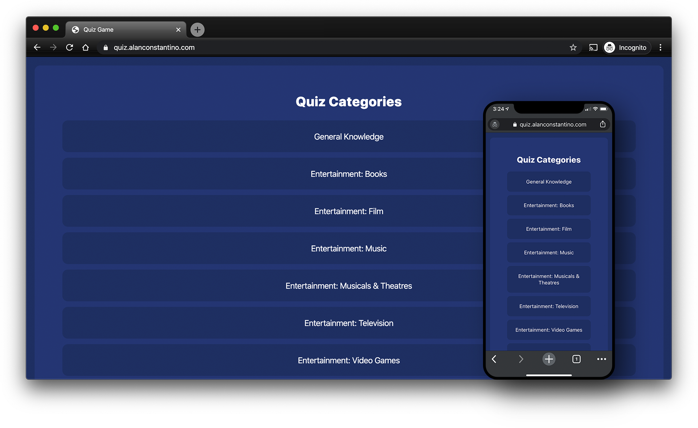
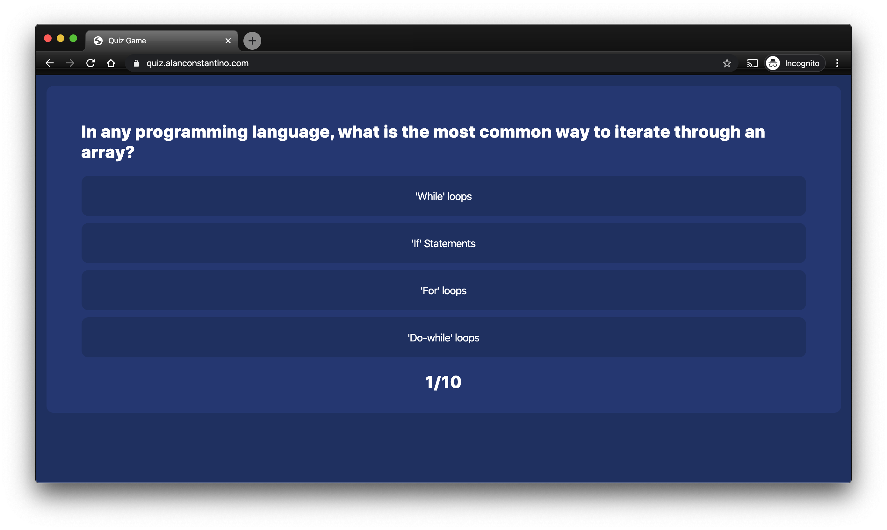
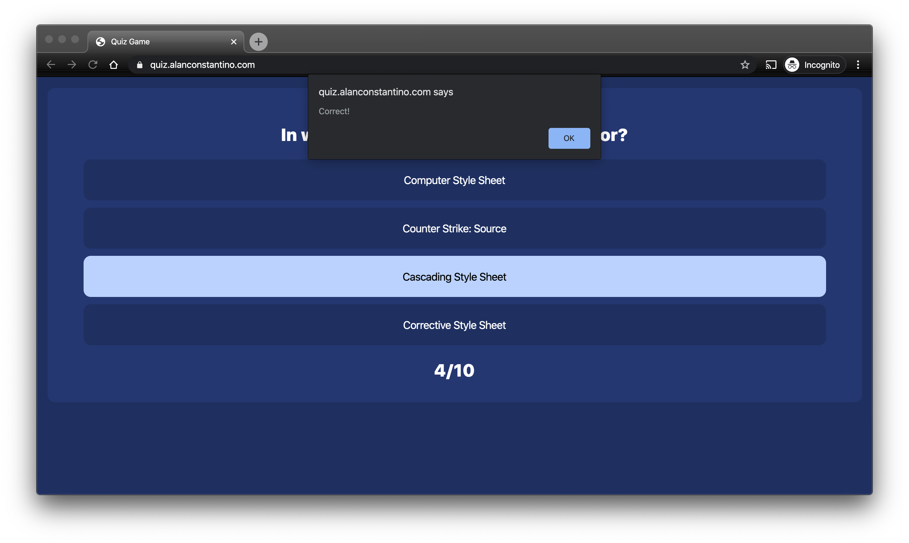

# [quiz-game](https://quiz.alanconstantino.com/)
A quiz game made with Javascript and the Open Trivia Database API.

[Link to quiz game](https://quiz.alanconstantino.com/)

# API Used
- [Open Trivia Database](https://opentdb.com/api_config.php)
  - Used for trivia questions and answers on various categories.

# Images

### Static Images

### GIFS

